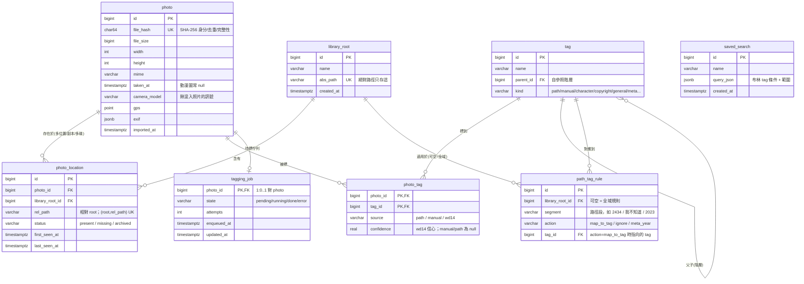

# 圖片管理系統 — 設計文件

- 日期:2026-06-21
- 狀態:已定案,進入實作規劃
- 範圍:單一使用者本機應用(Windows 11),圖庫十萬量級、以動漫圖為主、少量個人照片

---

## 1. 核心原則

三條正交的軸,不互相牽連:

- **物理儲存**(bytes 放哪)— 維運決定
- **邏輯分類**(怎麼搜)— 全進 DB,**不用資料夾分類**
- **儲存引擎**— scale + 查詢形狀決定

`file_hash`(SHA-256)是**身分**(去重 + 完整性),`file_path` 只是**位置**。

**標籤系統與檔案系統脫鉤:就地索引,絕不搬動、不改名、不寫入原始檔 bytes。** 系統只讀取、計算 hash、抽 metadata、把路徑拆成 tag 進 DB。看圖一律透過 app(瀏覽器),資料夾降級成「眾多 tag 軸之一」。

---

## 2. 技術棧(已定案)

| 層 | 選用 | 版本 / 備註 |
|---|---|---|
| 前端 | **Angular** + `@angular/cdk` | 最新 21/22(scaffold 時以 `ng new` 實抓為準),CDK virtual scroll 處理大量縮圖 |
| web 後端 | **C# / .NET 10**(ASP.NET Core) | 已裝 SDK `10.0.301`。內建掃描器背景服務、serve Angular 靜態檔 |
| ORM / DB 驅動 | **Npgsql.EntityFrameworkCore.PostgreSQL** | 與 EF Core 主版號對齊 → 10.x |
| EXIF | **MetadataExtractor** | 抽 `taken_at` / 相機 / GPS |
| 縮圖 / 尺寸 | **SixLabors.ImageSharp** | 個人用免費;產 webp 縮圖 |
| ML worker | **Python 3.13** | WD14 動漫自動標籤;`onnxruntime-directml` + `huggingface_hub` + `pillow`/`numpy` + `psycopg[binary]` |
| 向量(Phase 2) | **pgvector** | NuGet `pgvector` + PG `vector` 擴充;CLIP 階段才需要 |
| DB | **單顆 PostgreSQL** | 布林多軸查詢 + JSONB(EXIF)+ 日後 tsvector/GIN + pgvector |

環境現況(2026-06-21 重啟後):.NET `10.0.301` ✅、Node `v24.15.0` / npm `11.12.1` ✅、Docker `29.5.3` + compose `v5.1.4` ✅、**Python 未裝(worker 階段以 winget 裝 3.13)**。

---

## 3. 架構與元件

```
┌─────────────┐   REST    ┌────────────────────┐
│  Angular SPA │ ───────► │  ASP.NET Core API   │
│ (虛擬滾動相簿)│ ◄─────── │  查詢/縮圖/標籤/根管理 │
└─────────────┘           └─────────┬──────────┘
                                    │
                  ┌─────────────────┼──────────────────┐
                  ▼                 ▼                  ▼
          ┌──────────────┐  ┌──────────────┐   ┌──────────────┐
          │ Scanner/索引  │  │  Postgres     │   │ 縮圖快取(磁碟) │
          │(.NET 背景服務)│  │  單一真相      │   │ 依 hash 命名   │
          │ hash/EXIF/    │  │ photo/tag/... │   │ 絕不碰原圖     │
          │ 路徑→tag/偵測 │  │ + tagging_job │   └──────────────┘
          └──────────────┘  └──────┬───────┘
                                   │ DB-as-queue(輪詢 tagging_job)
                                   ▼
                          ┌──────────────────┐
                          │ Python ML worker  │
                          │ WD14 自動標籤      │
                          │ (Phase2 CLIP→pgvector)│
                          └──────────────────┘
```

1. **Angular SPA** — CDK virtual scroll 相簿、布林 tag 搜尋面板、Saved Search、標籤編輯器(接受/拒絕 WD14 建議)、失蹤檔案待確認匣、library root 管理、匯入路徑→tag 確認步驟。
2. **ASP.NET Core API** — 布林 tag 查詢(keyset 分頁)、serve 縮圖與原圖、tag/saved-search CRUD、root 管理、觸發掃描、reconcile 佇列、路徑→tag 規則確認。只 bind `localhost`,單機單人**不做帳號系統**。
3. **Scanner / 索引器(.NET 背景服務)** — 走訪 root、算 SHA-256、抽 EXIF、路徑→tag(經規則)、upsert `photo`/`photo_location`、用 hash 偵測搬移/失蹤、產縮圖、塞 `tagging_job`。內建於 .NET 後端,不另開行程。
4. **Python ML worker** — 輪詢 `tagging_job`,跑 WD14 ONNX(DirectML),寫回 `photo_tag`(source/confidence)。Phase 2 加 CLIP embedding → pgvector。
5. **Postgres** — 單一真相(見 §4)。
6. **縮圖快取** — app 自有目錄,依 `file_hash` 分桶(如 `thumbs/ab/cd/<hash>.webp`),衍生、可重建、絕不碰原圖。

**.NET ↔ Python 溝通 = DB-as-queue**(`tagging_job` 表):.NET 塞、Python 輪詢取走寫回。單機單人不上 RabbitMQ/Redis,DB 佇列耐重啟、好批次、少一個服務要顧(YAGNI)。

---

## 4. 資料模型

### 4.1 ER Model



### 4.2 DDL

```sql
-- ① 物理根:舊GDrive / 新硬碟 / 本機,絕對路徑只存這
CREATE TABLE library_root (
    id         BIGSERIAL PRIMARY KEY,
    name       VARCHAR(128) NOT NULL,
    abs_path   VARCHAR(1024) NOT NULL UNIQUE,
    created_at TIMESTAMPTZ NOT NULL DEFAULT now()
);

-- ② 身分:一張圖一列(file_hash 去重)
CREATE TABLE photo (
    id           BIGSERIAL PRIMARY KEY,
    file_hash    CHAR(64) NOT NULL UNIQUE,
    file_size    BIGINT,
    width        INT,
    height       INT,
    mime         VARCHAR(64),
    taken_at     TIMESTAMPTZ,
    camera_model VARCHAR(128),
    gps          POINT,
    exif         JSONB,
    imported_at  TIMESTAMPTZ NOT NULL DEFAULT now()
);

-- ③ 位置:一張圖 → 多個物理位置(副本/多碟/搬移)
CREATE TABLE photo_location (
    id              BIGSERIAL PRIMARY KEY,
    photo_id        BIGINT NOT NULL REFERENCES photo(id) ON DELETE CASCADE,
    library_root_id BIGINT NOT NULL REFERENCES library_root(id) ON DELETE CASCADE,
    rel_path        VARCHAR(1024) NOT NULL,
    status          VARCHAR(16) NOT NULL DEFAULT 'present',  -- present/missing/archived
    first_seen_at   TIMESTAMPTZ NOT NULL DEFAULT now(),
    last_seen_at    TIMESTAMPTZ NOT NULL DEFAULT now(),
    UNIQUE (library_root_id, rel_path)
);

-- ④ 標籤(階層 + 軸別)
CREATE TABLE tag (
    id        BIGSERIAL PRIMARY KEY,
    name      VARCHAR(128) NOT NULL,
    parent_id BIGINT REFERENCES tag(id),
    kind      VARCHAR(32) NOT NULL DEFAULT 'manual',
    UNIQUE (name, parent_id)
);

-- ⑤ 照片↔標籤(來源 + 信心)
CREATE TABLE photo_tag (
    photo_id   BIGINT NOT NULL REFERENCES photo(id) ON DELETE CASCADE,
    tag_id     BIGINT NOT NULL REFERENCES tag(id)   ON DELETE CASCADE,
    source     VARCHAR(16) NOT NULL,   -- path/manual/wd14
    confidence REAL,
    PRIMARY KEY (photo_id, tag_id)
);

-- ⑥ 學習型路徑段→動作規則(因應「匯入後確認」)
CREATE TABLE path_tag_rule (
    id              BIGSERIAL PRIMARY KEY,
    library_root_id BIGINT REFERENCES library_root(id) ON DELETE CASCADE,  -- NULL = 全域
    segment         VARCHAR(256) NOT NULL,
    action          VARCHAR(16) NOT NULL,   -- map_to_tag/ignore/meta_year
    tag_id          BIGINT REFERENCES tag(id),
    UNIQUE (library_root_id, segment)
);

-- ⑦ 存查詢不存資料夾
CREATE TABLE saved_search (
    id         BIGSERIAL PRIMARY KEY,
    name       VARCHAR(128) NOT NULL,
    query_json JSONB NOT NULL,
    created_at TIMESTAMPTZ NOT NULL DEFAULT now()
);

-- ⑧ DB-as-queue(.NET → Python)
CREATE TABLE tagging_job (
    photo_id    BIGINT PRIMARY KEY REFERENCES photo(id) ON DELETE CASCADE,
    state       VARCHAR(16) NOT NULL DEFAULT 'pending',  -- pending/running/done/error
    attempts    INT NOT NULL DEFAULT 0,
    enqueued_at TIMESTAMPTZ NOT NULL DEFAULT now(),
    updated_at  TIMESTAMPTZ
);

-- 十萬量級索引
CREATE INDEX ix_phototag_tag ON photo_tag (tag_id, photo_id);
CREATE INDEX ix_photo_taken  ON photo (taken_at);
CREATE INDEX ix_loc_photo    ON photo_location (photo_id);
CREATE INDEX ix_job_state    ON tagging_job (state) WHERE state IN ('pending','error');
-- Phase 2:ALTER TABLE photo ADD COLUMN embedding vector(768); + HNSW 索引
```

### 4.3 設計重點

1. **身分 / 位置兩層拆開(②③)** → 換碟、搬資料夾、同圖兩份全是 `photo_location` 的增刪,`photo` 身分不動 = 標籤與檔案系統脫鉤。
2. **`tag.kind` 軸別 + `photo_tag.source`/`confidence`** → 手動 IP 分類(path/manual)與 WD14 自動標(帶信心)分得開;可「只看手動」「WD14 信心 > 門檻才採用」「逐一接受/拒絕」。
3. **揪出混入的個人照片** → `camera_model`/`gps`/`exif` 存在性 + WD14 `realistic`/`photo` tag,組成 Saved Search 一鍵撈出。

### 4.4 布林多軸查詢(含全部 N 個 tag 的交集)

```sql
SELECT p.* FROM photo p
JOIN photo_tag pt ON pt.photo_id = p.id
WHERE pt.tag_id IN (:tagIds)
GROUP BY p.id HAVING count(DISTINCT pt.tag_id) = :n
-- keyset 分頁:AND p.id < :lastId ORDER BY p.id DESC LIMIT 200
```

---

## 5. 資料流

### 5.1 掃描 / 搬移偵測(Scanner)

```
對每個 library_root 走訪檔案:
  stat →
    若 (root, rel_path) 已存在且 size+mtime 沒變 → 跳過(快路徑不重算 hash)
    否則 → 算 SHA-256
      upsert photo BY hash(新 hash=新身分;抽 EXIF/尺寸;產縮圖;塞 tagging_job)
      upsert photo_location(root, rel_path)→ status=present, last_seen=now
      新出現的路徑段 → 收集進「待確認」(見 §5.4)
走訪結束 → 對帳:
  這輪沒被看到的 photo_location →
    該 photo 的 hash 在別處仍有 present 位置? → 是:此位置標 missing,不打擾(搬移/刪副本)
                                              → 否:整張圖失蹤 → 進待確認匣問使用者
```

### 5.2 標籤(Python worker)

```
輪詢 tagging_job WHERE state='pending' → 取一批 →
  讀原圖 bytes → WD14 ONNX(DirectML)推論 → 過信心門檻(預設 ~0.35,可調)→
  upsert tag(character/copyright/general,kind 對應)+ photo_tag(source=wd14, confidence)→
  job state=done(失敗 attempts++、state=error 可重試)
```

### 5.3 瀏覽 / 查詢(Angular ← API)

布林 tag 面板組查詢 → keyset 分頁拉縮圖 → CDK virtual scroll 只渲染可視範圍 → 點開取原圖。Saved Search 存 `query_json`。

### 5.4 路徑 → tag 確認(學習型)

匯入掃描收集所有出現過的路徑段 → 比對 `path_tag_rule`:
- 已有規則的段 → 直接套用(map_to_tag / ignore / meta_year)
- **沒見過的新段** → 列入確認清單給使用者決定動作 → 寫回 `path_tag_rule`

效果:每段只確認一次,之後重掃只問新段,不重複打擾。內建預設候選:`我不知道`→ignore、純數字年份→meta_year。

---

## 6. 關鍵決策日誌

| 決策 | 選擇 | 理由 |
|---|---|---|
| 檔案管理 | 就地索引,不動原始檔 | 標籤與檔案系統脫鉤;尊重既有 IP 資料夾結構 |
| 多路徑 | 多 library_root + photo_location 兩層 | GDrive 滿換碟、搬移、副本都不動身分 |
| 雲端占位符 | 不處理(檔案幾乎都本機實體) | 可直接讀 bytes 算 hash,最單純 |
| XMP 寫回 | **不做** | PNG 可藏惡意內容、改檔有風險;改用 pg_dump + 獨立 manifest 匯出防 lock-in |
| 移動/刪除偵測 | hash 對帳 + 待確認匣 | hash 是身分,搬移自動續接,真失蹤才問 |
| 刪除語意 | **軟刪**(archived) | 保留 photo+tags,同 hash 回來自動復原;硬刪需手動 purge |
| WD14 範圍 | 角色 + 作品 + 一般屬性 | 攻「我不知道」那堆 + 屬性語意篩選;門檻可調 |
| GPU | `onnxruntime-directml` | 跨 NVIDIA(現機)/ AMD(住處)同程式碼,無 GPU 退 CPU |
| 路徑→tag | 匯入後確認 + 學習型 `path_tag_rule` | 可控但不重複煩 |
| 後端溝通 | DB-as-queue | 單機單人免 broker,耐重啟 |
| API 認證 | 無(localhost only) | 單機單人 |
| 後端語言 | C#/.NET 10 + Python worker | web 啟動快;ML 生態留在 Python |

---

## 7. 交付 / 安裝(方案 C 混合)

- **Postgres 走 Docker**(`pgvector/pgvector` image)→ 最省事拿到 pgvector;
- **.NET API + Python worker 原生跑** → 直接讀十萬本機檔、啟動快(避開 Windows bind-mount 檔案存取慢)。
- 最終一鍵:`.NET publish` 自包含單檔 exe(免裝 runtime、serve Angular 靜態檔、拉起 Python worker)+ PowerShell 啟動腳本(起 DB → 起 exe → 開瀏覽器到 localhost)。

---

## 8. 錯誤處理 / 邊界

- **同 hash 多位置** → `photo_location` 多列,天然去重。
- **檔案鎖定/讀不到** → 位置標 error,下輪重試,不阻斷整批。
- **壞圖/非圖檔** → 略過記 log,不進庫。
- **搬移後重掃** → hash 命中 → 換位置不產重複身分,tag 不丟。
- **WD14 job 失敗** → state=error + attempts,可重跑。
- **單顆 Postgres 是唯一真相**(無 XMP)→ pg_dump 排程 + 可選 tag manifest 匯出(獨立檔不碰原圖)。

---

## 9. 測試策略

- **單元**:SHA-256 hash、路徑→tag 解析/規則套用、布林查詢產生器、**搬移 vs 刪除判定邏輯**(最該測)。
- **整合**:掃 fixture 樹 → 驗 photo/location/tag 列數;改名一檔重掃 → 驗位置更新「不」重複;刪一檔 → 驗進待確認匣;WD14 用假模型 → 驗 job 狀態轉換 + photo_tag 寫入。

---

## 10. 分階段

- **Phase 1(核心)**:schema + 掃描/對帳 + 路徑→tag 確認 + 布林查詢 + Angular 相簿 + 縮圖 + WD14 worker。**不含** embedding/pgvector。
- **Phase 2(語意搜尋)**:CLIP image embedding → `pgvector` hybrid query(結構化過濾 + 相似度排序);動漫上考慮日文/動漫微調 CLIP 變體。

---

## 11. 待真正動工才會明朗(使用者明示)

SQL schema 之後可改;以下細節留待實作中校正:
- WD14 具體模型(`wd-vit-tagger-v3` vs `swinv2` vs `convnext`)與最終信心門檻。
- 縮圖尺寸/格式參數(暫定 512px webp)。
- 路徑→tag 內建預設規則的細節。
- pg_dump 排程頻率與 tag manifest 匯出格式。
