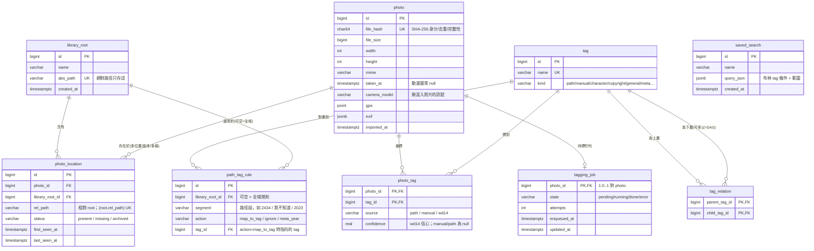

# 圖片管理系統 — 設計文件

- 日期:2026-06-21
- 狀態:已定案,進入實作規劃
- 範圍:單一使用者本機應用(Windows 11),圖庫十萬量級、以動漫圖為主、少量個人照片

---

## 1. 核心原則

三條正交的軸,不互相牽連:

- **物理儲存**(bytes 放哪)— 維運決定
- **邏輯分類**(怎麼搜)— 全進 DB,**不用資料夾分類**
- **儲存引擎**— scale + 查詢形狀決定

`file_hash`(SHA-256)是**身分**(去重 + 完整性),`file_path` 只是**位置**。

**標籤系統與檔案系統脫鉤:就地索引,絕不搬動、不改名、不寫入原始檔 bytes。** 系統只讀取、計算 hash、抽 metadata、把路徑拆成 tag 進 DB。看圖一律透過 app(瀏覽器),資料夾降級成「眾多 tag 軸之一」。

---

## 2. 技術棧(已定案)

> **架構修訂(2026-06-21,單程序收斂):** 原設計為「.NET + Python worker + Postgres/Docker」三件套多程序。經紅隊檢視(見 §7「單程序收斂」),為單機單人「雙擊即開、跨機穩、零常駐服務」,**收斂成單一 .NET 程序 + 嵌入式 SQLite + ONNX 在程序內推論**。Python/Postgres/Docker 退為「日後 NAS/多人」的可選路徑。推論本身 C# 與 Python 共用同一顆 ONNX Runtime 引擎,速度能力一致,非賭注;真正延後的只是「Python ML 生態的便利」,而 `tagging_job` 留作可重開的 seam(見 §3)。

| 層 | 選用 | 版本 / 備註 |
|---|---|---|
| 前端 | **Angular** + `@angular/cdk` | 最新 21/22(scaffold 時以 `ng new` 實抓為準),CDK virtual scroll 處理大量縮圖;`ng build` 產靜態檔交給 .NET serve |
| web 後端 + 宿主 | **C# / .NET 10**(ASP.NET Core) | 已裝 SDK `10.0.301`。**單一程序**內含:API + 掃描器背景服務 + ONNX 推論 + serve Angular 靜態檔 |
| ORM / DB 驅動 | **Microsoft.EntityFrameworkCore.Sqlite** | EF Core 10.x 的 SQLite provider |
| DB | **嵌入式 SQLite** | in-process、檔案式、零安裝(如 Java H2 embedded);扛布林多軸查詢 + JSON(EXIF)+ FTS5 + recursive CTE;多寫入由單程序天然序列化 |
| ML 推論 | **Microsoft.ML.OnnxRuntime.DirectML** | NuGet `1.24.x`;WD14 ONNX 在 .NET 程序內跑;EP 經 `IInferenceSessionFactory` 抽象(DirectML / 日後 CUDA / CPU fallback,開機偵測或參數選) |
| EXIF | **MetadataExtractor** | 抽 `taken_at` / 相機 / GPS |
| 縮圖 / 尺寸 | **SixLabors.ImageSharp** | 個人用免費;產 webp 縮圖;兼做 WD14 前處理(resize 448²、BGR) |
| 向量(Phase 2) | **sqlite-vec** 或遷 **Postgres+pgvector** | CLIP 階段才需要;sqlite-vec 仍 alpha,屆時評估「就地 sqlite-vec」vs「一次性遷 Postgres」 |
| (可選/未來) ML sidecar | **Python** | 僅遇到難轉 ONNX 的新模型才開回;以**無狀態 compute sidecar**:只推論、結果 POST 回 C# API,不直連 DB(避開 SQLite 雙寫) |

環境現況(2026-06-21 重啟後):.NET `10.0.301` ✅、Node `v24.15.0` / npm `11.12.1` ✅。**Phase 1 不再需要 Docker 或 Python**(Docker `29.5.3` 已裝,僅日後 NAS 包裝用;Python 僅未來 sidecar 才裝)。

---

## 3. 架構與元件

```
┌──────────────┐
│  Angular SPA  │  (ng build 靜態檔,由下面的 .NET 程序 serve)
│ (虛擬滾動相簿) │
└──────┬───────┘
       │ REST(localhost)
       ▼
┌──────────────────────────────────────────────────┐
│            單一 .NET 程序(ASP.NET Core)            │
│  ┌──────────┐  ┌───────────┐  ┌───────────────┐   │
│  │  API     │  │ Scanner   │  │ 標籤背景服務    │   │
│  │ 查詢/縮圖 │  │ 索引/對帳  │  │ 抽 tagging_job │   │
│  │ /CRUD    │  │ hash/EXIF │  │ → ONNX in-proc │   │
│  └────┬─────┘  └─────┬─────┘  └──────┬────────┘   │
│       └──────────────┼───────────────┘            │
│                      ▼                             │
│      IInferenceSessionFactory(DML / CUDA / CPU)    │
└──────────────────────┬─────────────────────────────┘
          ┌────────────┼──────────────┐
          ▼            ▼              ▼
   ┌────────────┐ ┌──────────┐ ┌───────────────┐
   │ SQLite 檔   │ │ 縮圖快取  │ │ (未來/可選)    │
   │ 單一真相    │ │ 依 hash   │ │ Python compute │
   │ +tagging_job│ │ 絕不碰原圖 │ │ sidecar        │
   └────────────┘ └──────────┘ └───────────────┘
```

1. **Angular SPA** — CDK virtual scroll 相簿、布林 tag 搜尋面板、Saved Search、標籤編輯器(接受/拒絕 WD14 建議)、失蹤檔案待確認匣、library root 管理、匯入路徑→tag 確認步驟。`ng build` 產靜態檔由 .NET 程序 serve。
2. **單一 .NET 程序(ASP.NET Core)** — 一個行程內同時是:
   - **API** — 布林 tag 查詢(keyset 分頁)、serve 縮圖與原圖、tag/saved-search CRUD、root 管理、觸發掃描、reconcile 佇列、路徑→tag 規則確認。只 bind `localhost`,**不做帳號系統**。
   - **Scanner / 索引器(背景服務)** — 走訪 root、算 SHA-256、抽 EXIF、路徑→tag(經規則)、upsert `photo`/`photo_location`、用 hash 偵測搬移/失蹤、產縮圖、塞 `tagging_job`。
   - **標籤背景服務** — 抽 `tagging_job`(**程序內 DB-backed 佇列**:`System.Threading.Channels` + `BackgroundService`,並行上限/重試/背壓),跑 WD14 ONNX 推論,寫回 `photo_tag`(source/confidence)。
   - **`IInferenceSessionFactory`** — 抽象 ONNX Execution Provider:開機依偵測顯卡或啟動參數選 DirectML / (日後)CUDA / CPU fallback。把「DirectML 維護模式」風險關進此介面,可隨時抽換。
3. **SQLite(嵌入式檔案)** — 單一真相(見 §4)。in-process,單程序天然序列化寫入,無 server、無 port、無常駐服務。
4. **縮圖快取** — app 自有目錄,依 `file_hash` 分桶(如 `thumbs/ab/cd/<hash>.webp`),衍生、可重建、絕不碰原圖。
5. **(未來/可選)Python compute sidecar** — 僅當遇到難轉 ONNX 的新模型才開回;**無狀態**:只做推論,結果 POST 回 C# API,**不直連 SQLite**(避開雙寫)。`tagging_job` 即這道可重開的 seam。

**單程序的代價與保留:** 收掉第二程序 → 不需跨程序 broker/queue,但 `tagging_job` 表保留作**持久工作清單**(隔夜續跑、重試、可被未來 sidecar 接管)。GPU crash 會影響整個程序 → 推論置於獨立背景執行緒、可選分批,降低衝擊(YAGNI:單人本機,重啟成本低)。

---

## 4. 資料模型

### 4.1 ER Model



### 4.2 DDL

> **以 EF Core SQLite 實現。** 下方 DDL 為**概念示意**(Postgres 風格);SQLite 落地時型別由 EF 對應:`BIGSERIAL`→`INTEGER PRIMARY KEY AUTOINCREMENT`、`TIMESTAMPTZ`→`TEXT`(ISO8601)、`JSONB`→`TEXT`(配 SQLite JSON 函式)、`CHAR(64)`→`TEXT`。**結構性差異:SQLite 無 `POINT` 型別,GPS 改存 `gps_lat`/`gps_lon` 兩個 `REAL`。** 部分索引、recursive CTE、`GROUP BY ... HAVING count(DISTINCT)` 交集查詢 SQLite 皆支援。

```sql
-- ① 物理根:舊GDrive / 新硬碟 / 本機,絕對路徑只存這
CREATE TABLE library_root (
    id         BIGSERIAL PRIMARY KEY,
    name       VARCHAR(128) NOT NULL,
    abs_path   VARCHAR(1024) NOT NULL UNIQUE,
    created_at TIMESTAMPTZ NOT NULL DEFAULT now()
);

-- ② 身分:一張圖一列(file_hash 去重)
CREATE TABLE photo (
    id           BIGSERIAL PRIMARY KEY,
    file_hash    CHAR(64) NOT NULL UNIQUE,
    file_size    BIGINT,
    width        INT,
    height       INT,
    mime         VARCHAR(64),
    taken_at     TIMESTAMPTZ,
    camera_model VARCHAR(128),
    gps_lat      REAL,                                   -- SQLite 無 POINT,GPS 拆兩欄
    gps_lon      REAL,
    exif         JSONB,
    imported_at  TIMESTAMPTZ NOT NULL DEFAULT now()
);

-- ③ 位置:一張圖 → 多個物理位置(副本/多碟/搬移)
CREATE TABLE photo_location (
    id              BIGSERIAL PRIMARY KEY,
    photo_id        BIGINT NOT NULL REFERENCES photo(id) ON DELETE CASCADE,
    library_root_id BIGINT NOT NULL REFERENCES library_root(id) ON DELETE CASCADE,
    rel_path        VARCHAR(1024) NOT NULL,
    status          VARCHAR(16) NOT NULL DEFAULT 'present',  -- present/missing/archived
    first_seen_at   TIMESTAMPTZ NOT NULL DEFAULT now(),
    last_seen_at    TIMESTAMPTZ NOT NULL DEFAULT now(),
    UNIQUE (library_root_id, rel_path)
);

-- ④ 標籤(軸別)
CREATE TABLE tag (
    id   BIGSERIAL PRIMARY KEY,
    name VARCHAR(128) NOT NULL UNIQUE,           -- booru 式全域唯一名
    kind VARCHAR(32) NOT NULL DEFAULT 'manual'
);

-- ④b 標籤關係(DAG:一個 tag 可有 0/1/多個上層;不知道上游=無此關係,留最上層)
-- 搜上層自動涵蓋旗下所有後代(tag implication),用 recursive CTE 查;應用層擋環。
CREATE TABLE tag_relation (
    parent_tag_id BIGINT NOT NULL REFERENCES tag(id) ON DELETE CASCADE,
    child_tag_id  BIGINT NOT NULL REFERENCES tag(id) ON DELETE CASCADE,
    PRIMARY KEY (parent_tag_id, child_tag_id),
    CHECK (parent_tag_id <> child_tag_id)
);
CREATE INDEX ix_tagrel_child ON tag_relation (child_tag_id);

-- ⑤ 照片↔標籤(來源 + 信心)
CREATE TABLE photo_tag (
    photo_id   BIGINT NOT NULL REFERENCES photo(id) ON DELETE CASCADE,
    tag_id     BIGINT NOT NULL REFERENCES tag(id)   ON DELETE CASCADE,
    source     VARCHAR(16) NOT NULL,   -- path/manual/wd14
    confidence REAL,
    PRIMARY KEY (photo_id, tag_id)
);

-- ⑥ 學習型路徑段→動作規則(因應「匯入後確認」)
CREATE TABLE path_tag_rule (
    id              BIGSERIAL PRIMARY KEY,
    library_root_id BIGINT REFERENCES library_root(id) ON DELETE CASCADE,  -- NULL = 全域
    segment         VARCHAR(256) NOT NULL,
    action          VARCHAR(16) NOT NULL,   -- map_to_tag/ignore/meta_year
    tag_id          BIGINT REFERENCES tag(id),
    UNIQUE (library_root_id, segment)
);

-- ⑦ 存查詢不存資料夾
CREATE TABLE saved_search (
    id         BIGSERIAL PRIMARY KEY,
    name       VARCHAR(128) NOT NULL,
    query_json JSONB NOT NULL,
    created_at TIMESTAMPTZ NOT NULL DEFAULT now()
);

-- ⑧ DB-as-queue(.NET → Python)
CREATE TABLE tagging_job (
    photo_id    BIGINT PRIMARY KEY REFERENCES photo(id) ON DELETE CASCADE,
    state       VARCHAR(16) NOT NULL DEFAULT 'pending',  -- pending/running/done/error
    attempts    INT NOT NULL DEFAULT 0,
    enqueued_at TIMESTAMPTZ NOT NULL DEFAULT now(),
    updated_at  TIMESTAMPTZ
);

-- 十萬量級索引
CREATE INDEX ix_phototag_tag ON photo_tag (tag_id, photo_id);
CREATE INDEX ix_photo_taken  ON photo (taken_at);
CREATE INDEX ix_loc_photo    ON photo_location (photo_id);
CREATE INDEX ix_job_state    ON tagging_job (state) WHERE state IN ('pending','error');
-- Phase 2:語意搜尋向量。SQLite 走 sqlite-vec(vec0 虛擬表),或屆時遷 Postgres+pgvector(vector(768)+HNSW)
```

### 4.3 設計重點

1. **身分 / 位置兩層拆開(②③)** → 換碟、搬資料夾、同圖兩份全是 `photo_location` 的增刪,`photo` 身分不動 = 標籤與檔案系統脫鉤。
2. **`tag.kind` 軸別 + `photo_tag.source`/`confidence`** → 手動 IP 分類(path/manual)與 WD14 自動標(帶信心)分得開;可「只看手動」「WD14 信心 > 門檻才採用」「逐一接受/拒絕」。
3. **揪出混入的個人照片** → `camera_model`/`gps`/`exif` 存在性 + WD14 `realistic`/`photo` tag,組成 Saved Search 一鍵撈出。

### 4.4 布林多軸查詢(含全部 N 個 tag 的交集)

```sql
SELECT p.* FROM photo p
JOIN photo_tag pt ON pt.photo_id = p.id
WHERE pt.tag_id IN (:tagIds)
GROUP BY p.id HAVING count(DISTINCT pt.tag_id) = :n
-- keyset 分頁:AND p.id < :lastId ORDER BY p.id DESC LIMIT 200
```

---

## 5. 資料流

### 5.1 掃描 / 搬移偵測(Scanner)

```
對每個 library_root 走訪檔案:
  stat →
    若 (root, rel_path) 已存在且 size+mtime 沒變 → 跳過(快路徑不重算 hash)
    否則 → 算 SHA-256
      upsert photo BY hash(新 hash=新身分;抽 EXIF/尺寸;產縮圖;塞 tagging_job)
      upsert photo_location(root, rel_path)→ status=present, last_seen=now
      新出現的路徑段 → 收集進「待確認」(見 §5.4)
走訪結束 → 對帳:
  這輪沒被看到的 photo_location →
    該 photo 的 hash 在別處仍有 present 位置? → 是:此位置標 missing,不打擾(搬移/刪副本)
                                              → 否:整張圖失蹤 → 進待確認匣問使用者
```

### 5.2 標籤(.NET 程序內背景服務)

```
背景服務抽 tagging_job WHERE state='pending' → 取一批 →
  讀原圖 bytes → WD14 ONNX(經 IInferenceSessionFactory:DirectML/CUDA/CPU)推論 → 過信心門檻(預設 ~0.35,可調)→
  upsert tag(character/copyright/general,kind 對應)+ photo_tag(source=wd14, confidence)→
  job state=done(失敗 attempts++、state=error 可重試)
```

### 5.3 瀏覽 / 查詢(Angular ← API)

布林 tag 面板組查詢 → keyset 分頁拉縮圖 → CDK virtual scroll 只渲染可視範圍 → 點開取原圖。Saved Search 存 `query_json`。

### 5.4 路徑 → tag 確認(學習型)

匯入掃描收集所有出現過的路徑段 → 比對 `path_tag_rule`:
- 已有規則的段 → 直接套用(map_to_tag / ignore / meta_year)
- **沒見過的新段** → 列入確認清單給使用者決定動作 → 寫回 `path_tag_rule`

效果:每段只確認一次,之後重掃只問新段,不重複打擾。內建預設候選:`我不知道`→ignore、純數字年份→meta_year。

---

## 6. UI / UX 設計

可點的 mockup:`docs/mockups/ui-preview.html`(瀏覽器開啟;`?view=<gallery|import|reconcile|saved|roots>` 與 `?only=inspector` 供切換/截圖)。視覺方向仍可迭代。

### 6.1 設計語言

- **暗色三欄工作台**:圖片在暗中性背景最跳(Lightroom / booru 暗色模式同理),色彩只留給標籤,機殼維持中性 charcoal。
- **Booru 分色標籤學(簽名)**:標籤顏色 = `tag.kind`,顏色本身即資訊,非裝飾。

  | kind | 顏色 | 對應 |
  |---|---|---|
  | character | 綠 `#4ADE80` | 角色 |
  | copyright | 紫 `#C084FC` | 作品 / 企劃 |
  | general | 藍 `#818CF8` | 屬性 |
  | meta | 琥珀 `#FBBF24` | 年份 / 其他 |
  | path | 灰 `#94A3B8` | 資料夾(降級的軸) |
  | manual | 粉 `#F472B6` | 我的手動標籤 |

  app 功能強調色 = 青 `#22D3EE`(僅用於主要動作 / 選取 / 焦點);破壞性 = 紅 `#F0616D`。
- **字體**:Space Grotesk(標題)/ Inter + Noto Sans TC(內文、中文)/ JetBrains Mono(hash、路徑、信心值等技術資料)。
- **版面**:活動列(58px 圖示)→ 側欄(情境式:篩選 / 來源…)→ 主區 → 檢視器(選圖時顯示)。VS Code 式,單機單人工具導向。

### 6.2 五個畫面

1. **圖庫**:頂部布林 tag 搜尋列(token 化、空格=AND、`-`=排除);左側篩選(階層樹 + 平面 facet);中央 CDK virtual scroll 瀑布流縮圖(hover 浮出分色 mini 標籤、`可能是照片` 徽章、`2 份` 去重標記);右側檢視器。
2. **檢視器(選圖)**:大預覽 →**「身分 → 位置」卡片(簽名元素)**:一個 `file_hash` 下掛多個位置 pill(本機 / 舊 GDrive…),直接把「身分 vs 位置」畫出來 → 標籤分色 lane(角色/作品/屬性/年份/資料夾)→ **WD14 建議**(虛線框 + 信心 % + 採用✓/拒絕✕)→ EXIF(動漫圖顯示「無相機 EXIF」,個人照片顯示相機/時間/GPS)。
3. **匯入確認(路徑→tag)**:表列沒見過的資料夾段 → 出現次數 / 範例路徑 / 建議動作(對應標籤·分色 / 略過不產 tag / 標為年份)。套用一次寫進 `path_tag_rule`,之後只問新段。
4. **失蹤待辦匣**:真失蹤(所有來源皆無、且無同 hash 副本)才進此;頂部提示「N 張只是換位置已自動續接」;每張可選 繼續等待 / 移到圖庫外 / 已刪除,並說明軟刪、同 hash 回來自動復原。
5. **圖庫來源**:多 root 清單(狀態 / 檔案數 / 上次掃描 / 重新掃描 / 新增來源)。

### 6.3 互動決策

- **階層樹(DAG)**:左側「作品 / 企劃 → 角色」可展開;不知上游的 tag 落在 **「— 無上層分類 —」** 桶,照常可用;多父 tag 標 `↟2` 徽章;搜上層自動涵蓋旗下後代(tag implication)。
- **標籤來源可辨**:已採用 = 實線分色 chip;WD14 建議 = 虛線 + 信心 %,逐一接受/拒絕。
- **揪混入的個人照片**:置頂特殊 Saved Search「可能是個人照片」(`has:exif OR tag:realistic`)。
- **跳回真實檔案系統(外部開啟)**:檢視器位置卡上提供三顆按鈕,語意分清。瀏覽器本身開不了檔案總管(沙盒),故一律**由原生跑在本機的 .NET 後端代為執行**;因 API bind `localhost`(鐵則 #8),能連到 API 的就保證是本機,不需另外偵測。
  - **在檔案總管顯示**(主要):後端 `explorer.exe /select,<path>` —— 僅反白不開檔,風險最低。
  - **用預設程式開啟**(次要):後端 `Process.Start(<path>)` 走 OS 關聯;等於開那張 PNG(鐵則 #1),使用者主動點才觸發,可接受。
  - **下載原圖**(Phase 2,先留位不接線):API 串檔案 bytes 回前端。純本機用不到,是日後「NAS / 多人 / SaaS 化」的種子 —— 唯有圖不只本機自己看時才需要。詳見 §11。
  - **實作鐵則**:① 後端只認 `photo_id`,路徑一律自 `library_root`+`rel_path` 組出,**絕不收前端傳來的任意路徑**(否則路徑注入 / 任意檔案開啟漏洞);② 位置 `status = missing` 時按鈕 disable。
- **存查詢不存資料夾**:Saved Search 為一級物件,同張圖可同時落在多個搜尋。
- **品質底線**:十萬量級走 virtual scroll + keyset 分頁;鍵盤焦點可見;尊重 `prefers-reduced-motion`。

## 7. 關鍵決策日誌

| 決策 | 選擇 | 理由 |
|---|---|---|
| 檔案管理 | 就地索引,不動原始檔 | 標籤與檔案系統脫鉤;尊重既有 IP 資料夾結構 |
| 多路徑 | 多 library_root + photo_location 兩層 | GDrive 滿換碟、搬移、副本都不動身分 |
| 雲端占位符 | 不處理(檔案幾乎都本機實體) | 可直接讀 bytes 算 hash,最單純 |
| XMP 寫回 | **不做** | PNG 可藏惡意內容、改檔有風險;改用 pg_dump + 獨立 manifest 匯出防 lock-in |
| 移動/刪除偵測 | hash 對帳 + 待確認匣 | hash 是身分,搬移自動續接,真失蹤才問 |
| 刪除語意 | **軟刪**(archived) | 保留 photo+tags,同 hash 回來自動復原;硬刪需手動 purge |
| WD14 範圍 | 角色 + 作品 + 一般屬性 | 攻「我不知道」那堆 + 屬性語意篩選;門檻可調 |
| GPU / EP | `IInferenceSessionFactory` 抽象,預設 DirectML | 跨 NVIDIA(現機)/ AMD(住處);DirectML 維護模式風險關進介面,可換 CUDA/CPU;一檔通吃,要 NV 全速再加 CUDA publish profile |
| 路徑→tag | 匯入後確認 + 學習型 `path_tag_rule` | 可控但不重複煩 |
| 標籤階層 | **DAG `tag_relation` 邊表(可多父)** | 階層是可選彙整非必填;不知上游=留最上層;支援跨企劃聯動單位多重隸屬;搜上層自動涵蓋後代 |
| **單程序收斂** | **ML 收進 .NET 程序內(ONNX in-proc),非 Python worker** | C#/Python 共用同一 ONNX 引擎、推論能力一致非賭注;收掉第二程序→免 broker/server DB;`tagging_job` 留作程序內持久佇列 + 未來 Python sidecar 的 seam |
| **儲存引擎** | **嵌入式 SQLite(非 Postgres)** | 單機單人雙擊即開、零常駐服務、免 Docker/WSL(遊戲玩家會關 WSL);單程序天然序列化寫入;Phase 2 語意搜尋再 sqlite-vec / 遷 PG |
| API 認證 | 無(localhost only) | 單機單人;**離開 localhost 即必須加**(見 §11) |
| 外部開啟 | 後端代開檔案總管 / 預設程式;下載原圖留 Phase 2 | 瀏覽器沙盒開不了,原生後端可;只認 photo_id 防路徑注入 |
| 後端語言 | C#/.NET 10(單程序);Python 僅未來可選 sidecar | web 啟動快、交付為單一 exe;ML 生態之門以 sidecar 保留可重開 |

---

## 8. 交付 / 安裝(單一 exe 為主)

B 架構把整個 app 收成單一 .NET 程序(serve Angular + API + 掃描器 + ONNX in-proc + SQLite 檔),交付是「一個核心 + 兩個包裝」:

- **自包含單檔 exe(主力)** — `dotnet publish -r win-x64 --self-contained -p:PublishSingleFile=true`;SQLite、DirectML EP、Angular 靜態檔全包進去。**免裝 .NET runtime / Docker / Postgres / Python**,雙擊即開,DB 是同目錄一個 `.sqlite` 檔。
- **安裝版(可選包裝)** — 用 Velopack / Inno Setup 把上面那顆 exe 包成安裝包:開始選單捷徑、自動更新、首次建資料夾。底層同一顆 exe。
- **單顆 Docker image(可選,僅日後 NAS / headless / Linux 伺服器)** — 把 .NET app 裝進 image。⚠️ DirectML 是 Windows-only,**Linux container 內推論退回 CPU**(除非另接 Linux GPU EP)。非 Windows 本機日常所需。

> 原「方案 C 混合(Postgres 走 Docker + .NET/Python 原生)」因收斂為單程序 + SQLite 而**作廢**;Windows 上 Phase 1 不再需要 Docker。
> NV 要全速:加一個引 `Microsoft.ML.OnnxRuntime.Gpu`(CUDA)的 publish profile,`IInferenceSessionFactory` 程式碼不動(見 §7 GPU/EP)。

---

## 9. 錯誤處理 / 邊界

- **同 hash 多位置** → `photo_location` 多列,天然去重。
- **檔案鎖定/讀不到** → 位置標 error,下輪重試,不阻斷整批。
- **壞圖/非圖檔** → 略過記 log,不進庫。
- **搬移後重掃** → hash 命中 → 換位置不產重複身分,tag 不丟。
- **WD14 job 失敗** → state=error + attempts,可重跑。
- **SQLite 檔是唯一真相**(無 XMP)→ 備份 = 複製該 `.sqlite` 檔(可熱備:`VACUUM INTO`)+ tag manifest 匯出(`hash,tag` 獨立檔,不碰原圖;建議早做,避免策展綁死單一 app)。

---

## 10. 測試策略

- **單元**:SHA-256 hash、路徑→tag 解析/規則套用、布林查詢產生器、**搬移 vs 刪除判定邏輯**(最該測)。
- **整合**:掃 fixture 樹 → 驗 photo/location/tag 列數;改名一檔重掃 → 驗位置更新「不」重複;刪一檔 → 驗進待確認匣;WD14 用假模型 → 驗 job 狀態轉換 + photo_tag 寫入。

---

## 11. 分階段

- **Phase 1(核心)**:schema + 掃描/對帳 + 路徑→tag 確認 + 布林查詢 + Angular 相簿 + 縮圖 + WD14 worker。**不含** embedding/pgvector。
- **Phase 2(語意搜尋)**:CLIP image embedding → 向量查詢(結構化過濾 + 相似度排序);**儲存走 sqlite-vec(vec0 虛擬表)**,若屆時 sqlite-vec 仍 alpha/不夠用,則**一次性遷 Postgres+pgvector**(EF 抽象在,資料搬移為主)。動漫上考慮日文/動漫微調 CLIP 變體。CLIP 推論同樣經 `IInferenceSessionFactory` 在程序內跑;若該模型難轉 ONNX,才開回 Python compute sidecar(無狀態、POST 回 API)。
- **Phase 2(可選:離開純本機 / NAS / 多人)**:由「下載原圖」需求延伸 —— 圖不只本機自己看時。**要動三件事,不只 CORS**:① **bind 位址**從 `localhost` 改 `0.0.0.0`/區網 IP(別人連得到的關鍵);② **CORS 白名單**做成設定檔可調(讓別網域前端能呼叫);③ **認證**——⚠️ 安全紅線:**一旦 bind 改離 localhost,認證就從「無」(鐵則 #8)變成必須**,否則整個圖庫對區網裸奔。bind 與 CORS 都做成設定檔參數,並在設定處註明這條紅線,避免隨手改 bind 卻沒上鎖。

---

## 12. 待真正動工才會明朗(使用者明示)

SQL schema 之後可改;以下細節留待實作中校正:
- WD14 具體模型(`wd-vit-tagger-v3` vs `swinv2` vs `convnext`)與最終信心門檻。
- 縮圖尺寸/格式參數(暫定 512px webp)。
- 路徑→tag 內建預設規則的細節。
- pg_dump 排程頻率與 tag manifest 匯出格式。
